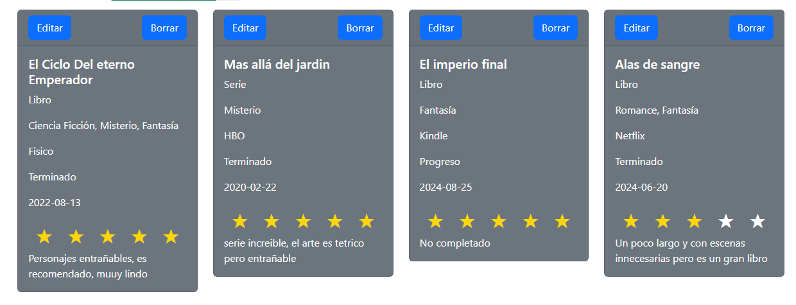

# Proyecto: Biblioteca de Recursos

Este proyecto es una aplicación web que permite a los usuarios llevar un registro de su progreso al ver series, películas y leer libros. Los usuarios pueden agregar, modificar y eliminar registros de sus recursos, facilitando el seguimiento y organización de su contenido multimedia.

## Descripción

La aplicación permite gestionar una biblioteca personal donde los usuarios pueden almacenar información sobre libros, películas y series, indicando su estado, valoración, y otros detalles relevantes. Todo esto se realiza mediante una interfaz amigable y responsive, desarrollada en HTML, ( CSS & Bootstrap ) y JavaScript puro.

## Funcionalidades

### CRUD (Create, Read, Upload, Delete)

1. **Crear Recursos**:
    - Los usuarios pueden añadir un nuevo recurso haciendo clic en el botón azul 'Agregar recurso' ubicado en la barra de navegación superior. Al agregar un recurso, se solicitan los siguientes campos:
        - Nombre del recurso.
        - Género (selección múltiple).
        - Plataforma (Netflix, Amazon, HBO, Kindle, Fisico).
        - Estado (Terminado, Progreso, Pendiente).
        - Formato (Serie, Película, Libro).
        - Fecha de terminación.
        - Valoración final (1 a 5 estrellas).
        - Reseña personal sobre el recurso.


2. **Leer Recursos**:
    - Los recursos se muestran en tarjetas con la siguiente información: nombre, género, plataforma, formato, estado, fecha de terminación, valoración (estrellas) y reseña personal. La valoración se representa con estrellas amarillas.



3. **Actualizar Recursos**:
    - Cada tarjeta tiene un botón 'Editar' que convierte los campos de la tarjeta en inputs editables, permitiendo modificar la información del recurso. El boton de 'Editar' cambia a 'Guardar' al hacer clic se actualizan los datos.


4. **Eliminar Recursos**:
    - Cada tarjeta también tiene un botón 'Borrar' que elimina el recurso de la lista y de la API.

### Filtros y Búsqueda

- La aplicación cuenta con varios filtro (género, plataforma, estado, formato, valoracion) accesibles mediante menús desplegables en la barra superior. 'Los filtros aplicados son apilables, lo que significa que se pueden aplicar varios filtros a la vez para hacer una búsqueda más específica.


- La barra de búsqueda permite encontrar un recurso específico por su nombre (tambien se puede combinar con los demás filtros).
- Los resultados de la búsqueda se actualizan al hacer clic en 'Search', mostrando solo los recursos que cumplen con los filtros seleccionados.
- Si deseas modificar o eliminar los filtros, puedes hacerlo individualmente o utilizar el botón 'Eliminar filtros' para eliminar todos los filtros aplicados y restaurar la búsqueda a su estado inicial.


### Porcentaje Completado

- En la parte superior, se muestra un indicador de 'Porcentaje completado', calculado como la cantidad de recursos con el estado 'Terminado' sobre el total de recursos: `(cantidad de terminados / total recursos) * 100`.


### Persistencia de Datos

- La información se almacena utilizando `mockApi`, lo que permite que los datos persistan aunque se cierre y reabra la aplicación .

## Tecnologías Utilizadas

- **HTML5**: Estructura y contenido de la aplicación.
- **CSS (Bootstrap)**: Estilización y diseño responsive.
- **JavaScript**: Funcionalidades de la aplicación (CRUD, filtros, validaciones).

## Requerimientos Técnicos

- El proyecto maneja de manera adecuada el modelo DOM para un funcionamiento fluido en el navegador.
- La interfaz es responsive y ha sido diseñada para ofrecer una experiencia amigable tanto en dispositivos móviles como de escritorio.

## Instalación

1. Clonar el repositorio:

   ```bash
   git clone https://github.com/usuario/Proyecto_JavaScript_Apellido1Nombre1.git
    ```
2. Descargar directamente desde GitHub:

- Dirígete al repositorio en GitHub. Haz clic en el botón verde 'Code' y selecciona 'Download ZIP'. Descomprime el archivo ZIP en tu máquina local

3. Clonar desde un editor de código como Visual Studio Code

- Abre Visual Studio Code.
- Ve a la opción 'Source Control' en la barra lateral.
- Selecciona 'Clone Repository' y pega el enlace del repositorio: https://github.com/usuario/Proyecto_JavaScript_Apellido1Nombre1.git.
- Elige la carpeta donde deseas clonar el proyecto.
